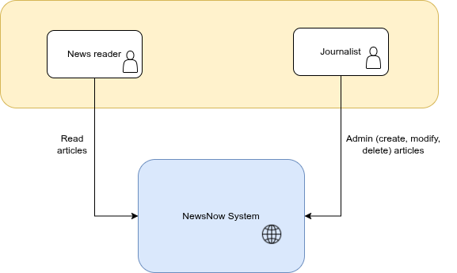

# 📰 Propuesta de Arquitectura: Portal de Noticias

A partir de la información recibida, propongo una solución **serverless**, **desacoplada** y **nativa de la nube**, desplegada en **AWS**. Se basa en un patrón **CQRS** para manejar eficientemente las cargas de trabajo, y se apoya en servicios gestionados para garantizar una **alta escalabilidad y seguridad**.

## 1. Requisitos Satisfechos

Esta solución responde a los siguientes requisitos clave:

* **Escalabilidad:** Para manejar posibles picos de tráfico, se proponen **Lambdas** para las APIs de lectura y escritura, y el servicio **CloudFront** para entregar contenido a los clientes.
* **Componentes:** Aunque se identifican 3 componentes inicialmente (2 sitios web y 1 API Rest), propongo **separar las responsabilidades del API Rest en dos** (siguiendo el patrón CQRS).
* **Uso del Cloud:** Se propone **AWS** con servicios gestionados (PaaS) como **RDS**, **ElastiCache**, **Cognito**, y **Lambdas**.
* **Seguridad:** Se incluye autenticación y autorización de usuarios para publicar noticias a través de **Cognito** y el uso de **tokens JWT**. Complementariamente, es posible implementar subredes dentro de la configuración de AWS.

### Portales Web a Implementar
1.  Portal Público de Noticias.
2.  Portal de Administración de Contenido.

## 2. Diagramas de Arquitectura (Modelo C4)

### C1 - Diagrama de Contexto

### C2 - Diagrama de Contenedores

**Componentes identificados para dar respuesta a los requerimientos**

| Contenedor | Descripción | Tecnologías/Función |
| :--- | :--- | :--- |
| **Front public** | Portal público para el acceso a lectores. | Angular |
| **Front Admin** | Portal privado para publicación de noticias. | Angular |
| **Api gateway** | Punto de acceso para centralizar acceso y seguridad a las APIs. | Valida JWT (Implícito) |
| **Authentication** | Servicio externo que gestiona identidades. | Cognito (Implícito) |
| **Read API Rest** | Responsable de leer (GET) las noticias a petición del portal público. | Consulta primero en cache, y luego en BD. |
| **Write API Rest** | Responsable de guardar (POST) los datos de las noticias en la base de datos. | Invalida caché (Implícito) |
| **Postgresql** | Almacena los datos de las noticias de manera persistente. | BD Relacional |
| **Redis** | Servicio cache para almacenar noticias y permitir lectura de acceso rápido. | Cache |
| **Media storage** | Almacén de medios para los contenidos de las noticias. | S3 (Implícito) |

### C3 - Diagrama de Despliegue

**Solución desplegada sobre AWS**

| Componente AWS | Propósito | Detalles |
| :--- | :--- | :--- |
| **CloudFront** | Sirve el contenido (imágenes y páginas) a los usuarios que acceden a la web. | CDN |
| **Frontend web files (S3)** | Almacena los archivos estáticos de las aplicaciones web compiladas. | Storage |
| **Images store (S3)** | Almacena las imágenes subidas por los periodistas. | Storage |
| **Api gateway** | Centraliza el acceso y control de seguridad a las api. | Compute |
| **Cognito** | Gestiona los usuarios y accesos. | Compute/Auth |
| **Read API (Lambda)** | Ejecuta la lógica para consultar datos. | Busca primero en la caché de Redis y, solo si no encuentra nada, lee de la base de datos. |
| **Write API (Lambda)** | Escribe en la base de datos principal, sube archivos a S3 e invalida la caché en Redis. | Compute |
| **Postgresql (RDS)** | Base de datos relacional y la fuente de la verdad para todos los datos de la aplicación, como los artículos y usuarios. | Data |
| **Redis (ElasticCache)** | Cache en memoria de alta velocidad. | Acelera las consultas y minimiza el acceso a la base de datos transaccional. |

## 3. Consideraciones

### Respuesta a Tráfico Masivo

Se implementan dos puntos en la solución para solventar esta casuística:
1.  **Cache a dos niveles:** El primero es dado por **CloudFront** que tiene cache de respuestas HTTP, y el segundo es el uso de **Redis**, ya que guarda en memoria los datos para responder a las consultas de noticias, y minimiza el acceso a la base de datos transaccional.
2.  **Lambdas:** La implementación de Lambdas permite que el **escalado sea de manera automática** en caso de peticiones altamente concurrentes.

---

### Puntos de Dolor o Posibles Problemas a Futuro

| Dolor | Posible Solución |
| :--- | :--- |
| Se seleccionen *influencers* para crear contenido dentro del portal y aumente la demanda al API de escritura. | Se podría implementar un un **sistema de colas** entre el API y la base de datos para no saturar el almacenamiento. |
| "Las imágenes subidas al sistema sean muchas y muy grandes, y tarden en el proceso de publicación de una noticia." | Se puede implementar la funcionalidad de **comprimir la calidad de la imagen**. También se debería configurar **políticas de archivado en S3** para los contenidos. |
| "Por temas administrativos, se requiere migrar la plataforma a otro servicio de nube." | Sería posible **empaquetar las lambdas en docker** y minimizar la parte de las API. |

## 4. ADR-001: Adopción de una Arquitectura Serverless con Patrón CQRS en AWS

**Estado:** En revisión

### Contexto
El cliente necesita lanzar una plataforma digital para su periódico. Los requisitos clave son la capacidad de manejar **picos de tráfico masivos**, y una preferencia por el uso de **servicios gestionados (PaaS)** para minimizar la carga operativa. El sistema debe tener un portal público de alta demanda para lectores y un portal de administración para que los periodistas puedan gestionar el contenido.

### Decisión
Se ha decidido implementar una **arquitectura serverless en AWS**, basada en el **patrón CQRS** (Command Query Responsibility Segregation).

### Consecuencias

#### Positivas
* **Alta Escalabilidad:** La combinación de Lambda, API Gateway y CloudFront permite al sistema manejar picos de tráfico sin intervención manual.
* **Excelente Rendimiento de Lectura:** La ruta de lectura dedicada y la caché de Redis garantizan una latencia mínima para los lectores de noticias.
* **Bajo Costo Operativo:** El uso exclusivo de servicios gestionados elimina la necesidad de administrar servidores, sistemas operativos o parches.
* **Eficiencia de Costos:** El modelo de pago por uso de los componentes serverless alinea el costo directamente con el tráfico real.

#### Negativas (Trade-offs)
* **Dependencia del Proveedor (Vendor Lock-in):** La arquitectura está fuertemente acoplada a AWS, lo que haría una migración a otra nube un proceso costoso.
* **Mayor Complejidad Inicial:** El patrón CQRS introduce más componentes móviles (dos APIs, una caché, un mecanismo de invalidación) en comparación con una API monolítica.
* **Depuración y Pruebas:** Replicar el entorno completo de la nube para pruebas locales puede ser más desafiante.